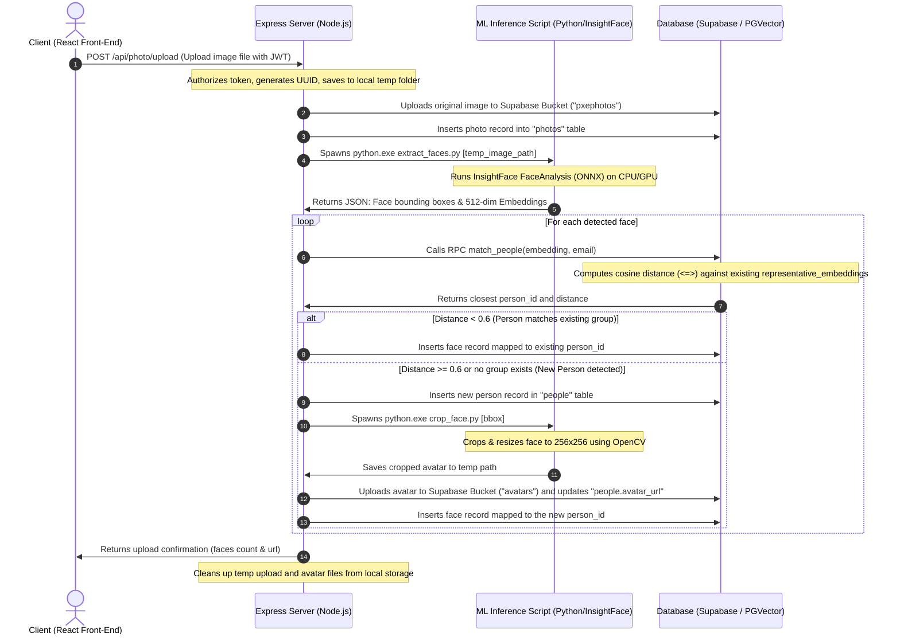
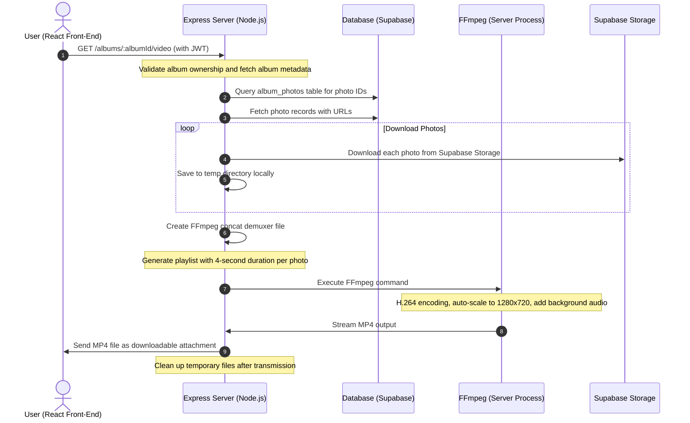

# Pxe Photos

An AI-powered, privacy-first photo organization and gallery application. **Pxe Photos** automatically scans uploaded photos, detects faces, extracts high-dimensional biometric embeddings, clusters them into people groups, and organizes them into custom albums with music and video slideshow capabilities.

---

## ✨ Latest Features (July 2026)

### 🎬 Album Video Slideshow Generation
- **New Backend Endpoint:** `/albums/:albumId/video` - Generates MP4 videos from photo albums
- **FFmpeg Integration:** Server-side video compilation with H.264 encoding
- **Background Music Support:** Albums can include curated music tracks during playback
- **Smart Photo Transitions:** Each photo displays for 4 seconds with smooth fade-in/out effects
- **Auto-scaling:** Photos automatically scaled and letterboxed to 1280x720 resolution
- **Download Support:** Users can download compiled slideshows as MP4 files with progress tracking
- **Cancellation Support:** Ability to cancel ongoing video downloads; automatic temp file cleanup

### 📷 Album Creation & Management
- **Album Creation Modal:** Intuitive UI for creating new photo albums
- **Photo Selection Grid:** Visual multi-select interface for choosing photos
- **Music Selection:** 6 pre-configured royalty-free music tracks:
  - 🎵 Calm Background (Default)
  - 🔇 No Music Option
  - 🎹 Für Elise (Classic)
  - 🎹 Keys of Tomorrow
  - 🎶 Lofi Chill Beats
  - 🌍 Travel Ambient
- **Custom Music URLs:** Support for uploading custom MP3 URLs
- **Album Gallery:** Browse and manage all created albums with cover photo previews

### 🎨 Enhanced Landing Page
- **Improved Hero Section:** Better animations and transitions
- **Feature Cards:** Three key feature highlights with icons
- **Call-to-Action:** Prominent "Get started free" button with smooth animations
- **Responsive Design:** Optimized for desktop and mobile viewports
- **Support Copy:** Clear value proposition below hero animation
- **Footer:** Project branding and context messaging

---

## ⚙️ Development Installation & Setup

Follow these steps to run the application in a local development environment.

### 1. Python Environment Setup

Navigate to the `python` directory and set up the virtual environment:

```bash
cd python
python -m venv venv
```

Activate the virtual environment:

```bash
# Windows (PowerShell)
.\venv\Scripts\Activate.ps1

# Windows (CMD)
.\venv\Scripts\activate

# macOS / Linux
source venv/bin/activate
```

Install machine learning packages and dependencies:

```bash
pip install -r requirements.txt
```

### 2. Backend Server Configuration

Navigate to the `server` directory:

```bash
cd ../server
npm install
```

Create a `.env` file in the `server` folder with the following variables:

```env
PORT=5000
JWT_SECRET="your-jwt-secure-signing-key"
SUPABASE_URL="https://your-supabase-project-id.supabase.co"
SUPABASE_SERVICE_ROLE_KEY="your-supabase-service-role-key"
```

Run the backend in development mode (spawns nodemon):

```bash
npm run dev
```

### 3. Frontend Web Configuration

Navigate to the `web` directory:

```bash
cd ../web
npm install
```

Run the Vite development server:

```bash
npm run dev
```

Open your browser and navigate to the local address output by Vite (usually `http://localhost:5173`).

---

## 🧠 System Architecture & Data Flow

Below is the workflow of **Pxe Photos** when a user uploads a new image:



### Album Video Generation Flow



---

## 📁 Folder & File Structure

This repository is divided into three main components: `/web` (React client), `/server` (Express API server), and `/python` (Machine Learning services).

```
pxephotos/
├── LICENSE
├── README.md                           # Main project documentation (this file)
├── index.html                          # Experimental HTML/CSS layout displaying a responsive photo grid
├── package.json                        # Root project node configuration
├── package-lock.json
│
├── python/                             # AI & Image Processing Services
│   ├── requirements.txt                # Python libraries (InsightFace, ONNX, OpenCV, Pillow)
│   ├── test.png                        # Test image used to verify face detection scripts
│   └── services/
│       ├── crop_face.py                # Uses OpenCV to crop face regions with padding and scale to 256x256
│       └── extract_faces.py            # Runs InsightFace models to extract bounding boxes and face embeddings
│
├── server/                             # Express.js Backend Server
│   ├── .env                            # API Keys, secrets, and Supabase connections
│   ├── index.js                        # App entry point; mounts routes and starts listener on Port 5000
│   ├── test.js                         # Simple backend test runner calling face extraction locally
│   ├── package.json                    # Backend NPM dependencies (JWT, Bcrypt, Multer, Supabase SDK, FFmpeg, Axios)
│   └── src/
│       ├── config/
│       │   └── supabase.js             # Initializer for the Supabase Client with service role authority
│       ├── controllers/
│       │   └── authController.js       # Validates client input and forwards requests to auth services
│       ├── middlewares/
│       │   └── authMiddleware.js       # Middleware validating JWT Bearer tokens
│       ├── repositories/
│       │   └── authRepo.js             # Repository placeholder reserved for SQL database operations
│       ├── routes/
│       │   ├── auth.js                 # Authentication endpoints (/signup, /me)
│       │   ├── avatar.js               # Retrieves list of clustered people (/people)
│       │   ├── people.js               # Retrieves photos containing specific people (/people/:personId/photos)
│       │   └── upload.js               # Handles photo upload flow, spawns Python processing, album management, video generation
│       └── services/
│           ├── authService.js          # Handles registration, password hashing (bcrypt), and login (JWT sign)
│           ├── avatarService.js        # Service layer interface that calls Python crop_face.py
│           ├── faceService.js          # Service layer interface that calls Python extract_faces.py
│           ├── personService.js        # Invokes DB RPC function to cluster embeddings and manage person entities
│           └── profileService.js       # Fetches authenticated user account details
│
└── web/                                # React Front-End Application
    ├── package.json                    # Frontend NPM dependencies (React 19, Vite 8, Tailwind v4, Motion, file-saver)
    ├── components.json                 # Shadcn-UI configuration
    ├── vite.config.ts                  # Vite + TypeScript configuration
    └── src/
        ├── main.tsx                    # Mounts the React application
        ├── index.css                   # Global styles + Tailwind CSS directives
        ├── App.tsx                     # Manages React Router configurations and Element paths
        ├── lib/
        │   └── utils.ts                # Tailwind CSS class merger utility
        └── components/
            ├── ui/                     # Aceternity & Shadcn UI Visual Components
            │   ├── badge.tsx           # Inline status indicator
            │   ├── button.tsx          # Custom premium buttons
            │   ├── canvas-reveal-effect.tsx # Visual background interactive grid
            │   ├── card.tsx            # Material cards
            │   ├── encrypted-text.tsx  # Sleek hacker-style randomized text revealer
            │   ├── file-upload.tsx     # Drag-and-drop dashboard upload input UI
            │   ├── floating-dock.tsx   # Glassmorphic dock navigation
            │   ├── focus-cards.tsx     # Hover-focused grid element
            │   ├── google-gemini-effect.tsx # Animated SVG curve tracer
            │   ├── input.tsx           # Visual input elements
            │   ├── label.tsx           # Standardized forms label
            │   ├── lamp.tsx            # Radial top-light neon lamp container
            │   └── tracing-beam.tsx    # Scroll-bound vertical progress tracer
            │
            └── features/               # Domain-Specific Features
                ├── account/
                │   └── ProfilePage.tsx # View displaying active user's details
                ├── albums/             # ✨ NEW: Album Management Features
                │   ├── Albums.tsx      # Album gallery with creation modal and music selection
                │   └── AlbumView.tsx   # Album slideshow viewer with playback controls and video download
                ├── auth/
                │   └── components/
                │       └── signup.tsx  # Dynamic Auth screen using Aceternity input systems
                ├── feed/
                │   ├── gallery.tsx     # User's general photo feed wrapped in a tracing beam
                │   └── samplephotos.tsx # Handles image fetch logic from backend feed endpoint
                ├── landingPage/
                │   └── hero.tsx        # High-impact introduction page utilizing Lamp and EncryptedText
                ├── people/
                │   ├── people.tsx      # Displays all clustered people with their cropped face avatars
                │   └── peopleGallery.tsx # Shows grid containing only photos matched to a specific person
                └── upload/
                    └── upload.tsx      # Drag-and-drop dashboard containing canvas reveal overlays
```

---

## 🛠️ Technology Stack

| Layer | Technology | Purpose |
| :--- | :--- | :--- |
| **Frontend** | **React 19** | Standardized UI component builder |
| | **Vite 8** | High-speed frontend dev server and bundler |
| | **TypeScript** | Type-safe development |
| | **Tailwind CSS v4** | Modern CSS-in-JS utility framework |
| | **Framer Motion (v12)**| Smooth, hardware-accelerated animations |
| | **Aceternity UI** | High-end visual and creative layout components |
| | **File-Saver** | Client-side MP4 download management |
| **Backend** | **Node.js + Express**| Rest API handlers, file streaming, and process orchestration |
| | **JWT / Bcrypt** | Secure password hashing and token-based stateful authentication |
| | **Multer** | Buffer-based file upload parser |
| | **FFmpeg (CLI)** | Server-side video encoding and slideshow generation |
| | **Fluent-FFmpeg** | Node.js wrapper for FFmpeg command orchestration |
| | **Axios** | HTTP client for downloading remote assets (photos, music) |
| **AI / ML** | **InsightFace** | Face detection & deep-learning 512-dimension embedding extraction |
| | **ONNX Runtime** | High-performance execution engine for InsightFace models |
| | **OpenCV (Python)** | High-speed image loading, cropping, and resizing operations |
| **Database** | **Supabase** | Cloud infrastructure provider (Authentication, Storage, SQL DB) |
| | **PostgreSQL** | Relational data persistence |
| | **pgvector** | Relational extension storing and calculating distance on high-dimensional vectors |

---

## 🗄️ Database Schema & Setup

Ensure the following tables and custom RPC function are created in your Supabase SQL editor:

```sql
-- 1. Enable the pgvector extension to store face embeddings
CREATE EXTENSION IF NOT EXISTS vector;

-- 2. Create Users Table
CREATE TABLE users (
    email TEXT PRIMARY KEY,
    firstname TEXT NOT NULL,
    lastname TEXT NOT NULL,
    hashedpassword TEXT NOT NULL,
    created_at TIMESTAMP WITH TIME ZONE DEFAULT timezone('utc'::text, now()) NOT NULL
);

-- 3. Create Photos Table
CREATE TABLE photos (
    id UUID PRIMARY KEY DEFAULT gen_random_uuid(),
    email TEXT REFERENCES users(email) ON DELETE CASCADE,
    url TEXT NOT NULL,
    created_at TIMESTAMP WITH TIME ZONE DEFAULT timezone('utc'::text, now()) NOT NULL
);

-- 4. Create People Table (Clustered groups)
CREATE TABLE people (
    id UUID PRIMARY KEY DEFAULT gen_random_uuid(),
    email TEXT REFERENCES users(email) ON DELETE CASCADE,
    avatar_url TEXT,
    representative_embedding vector(512),
    created_at TIMESTAMP WITH TIME ZONE DEFAULT timezone('utc'::text, now()) NOT NULL
);

-- 5. Create Faces Table (Individual detections mapped to original photos)
CREATE TABLE faces (
    id UUID PRIMARY KEY DEFAULT gen_random_uuid(),
    photo_id UUID REFERENCES photos(id) ON DELETE CASCADE,
    person_id UUID REFERENCES people(id) ON DELETE CASCADE,
    email TEXT REFERENCES users(email) ON DELETE CASCADE,
    bbox jsonb NOT NULL, -- Format: [x1, y1, x2, y2]
    embedding vector(512) NOT NULL,
    created_at TIMESTAMP WITH TIME ZONE DEFAULT timezone('utc'::text, now()) NOT NULL
);

-- 6. Create Albums Table (NEW: Album management)
CREATE TABLE albums (
    id UUID PRIMARY KEY DEFAULT gen_random_uuid(),
    email TEXT REFERENCES users(email) ON DELETE CASCADE,
    name TEXT NOT NULL,
    music_url TEXT,
    created_at TIMESTAMP WITH TIME ZONE DEFAULT timezone('utc'::text, now()) NOT NULL
);

-- 7. Create Album Photos Junction Table (NEW: Maps photos to albums)
CREATE TABLE album_photos (
    id UUID PRIMARY KEY DEFAULT gen_random_uuid(),
    album_id UUID REFERENCES albums(id) ON DELETE CASCADE,
    photo_id UUID REFERENCES photos(id) ON DELETE CASCADE,
    created_at TIMESTAMP WITH TIME ZONE DEFAULT timezone('utc'::text, now()) NOT NULL,
    UNIQUE(album_id, photo_id)
);

-- 8. Create similarity matching RPC function
CREATE OR REPLACE FUNCTION match_people(query_embedding vector(512), user_email TEXT)
RETURNS TABLE (
    id UUID,
    distance FLOAT
) AS $$
BEGIN
    RETURN QUERY
    SELECT
        people.id,
        (people.representative_embedding <=> query_embedding) AS distance
    FROM people
    WHERE people.email = user_email
    ORDER BY distance ASC;
END;
$$ LANGUAGE plpgsql;
```

---

## 💎 Innovations & Uniqueness

1. **Local Machine Learning Spawning Model:** Rather than maintaining a heavy, continuously-running Python web server (like FastAPI or Flask) which consumes memory, the Node.js backend dynamically spawns lightweight Python processes only when needed, reducing operational overhead.

2. **Postgres Vector Clustering:** Leverages `pgvector` directly in PostgreSQL, eliminating the need to sync embeddings with dedicated vector database services like Pinecone or Milvus.

3. **Aceternity UI Integration:** Uses React 19 and Vite 8 together with highly interactive premium layouts, breaking away from standard, boring template layouts to present a world-class visual experience.

4. **Server-Side Video Compilation:** Instead of relying on third-party video services (AWS MediaConvert, Cloudinary), the backend uses open-source FFmpeg to generate MP4 slideshows on-demand, maintaining complete privacy and cost efficiency.

5. **Smart Music Integration:** Albums support both pre-curated royalty-free tracks and custom user URLs, with intelligent audio-to-video synchronization and automatic duration management.

---

## 📜 License

This project is licensed under the terms of the [LICENSE](./LICENSE) file included in this repository.
